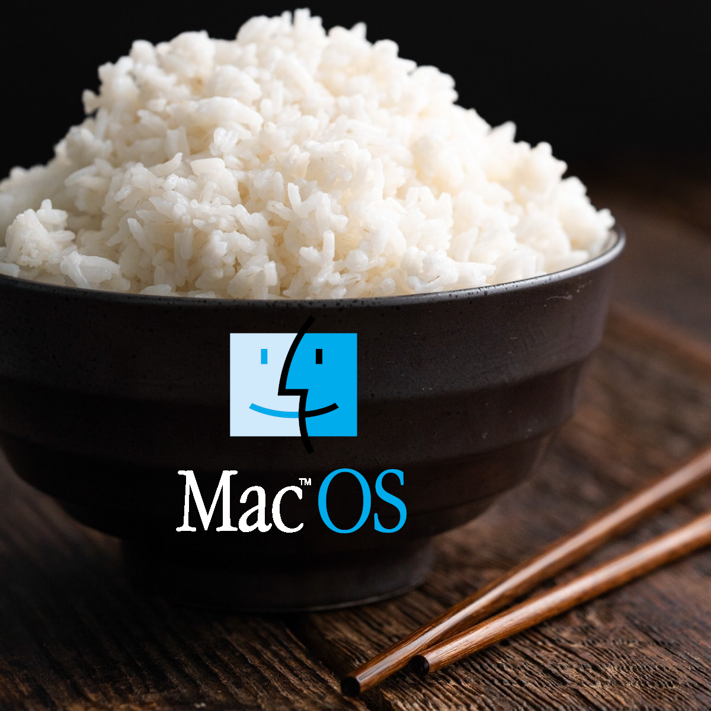

# macos-configs

<p align="center">
  
</p>

Backup and restore of my macOS dotfiles / app configs. Files are stored at their
path relative to `$HOME` (e.g. `~/.config/aerospace/aerospace.toml` lives here as
`.config/aerospace/aerospace.toml`).

## Scripts

| Script              | Direction                | What it does |
|---------------------|--------------------------|--------------|
| `scripts/backup.sh`  | live configs → repo      | Copies each tracked file from `$HOME` into this repo. |
| `scripts/deploy.sh`  | repo → live locations    | Copies the repo's files back to their `$HOME` paths. |
| `scripts/install.sh` | Brewfile → Homebrew      | Installs Homebrew (if needed) and everything in `Brewfile`. |

```bash
./scripts/backup.sh          # pull current configs into the repo

./scripts/deploy.sh          # preview, then confirm before overwriting
./scripts/deploy.sh -y       # skip the confirmation prompt
./scripts/deploy.sh -n       # dry run: show what would change, touch nothing

./scripts/install.sh         # install Homebrew + all Brewfile packages
./scripts/install.sh --check # report what's missing, install nothing
```

`deploy.sh` previews every action, asks before writing, and backs up any existing
target to `<file>.bak.<timestamp>` before overwriting.

## Tracked files

- `.config/aerospace/aerospace.toml`
- `.config/karabiner/karabiner.json`
- `.config/snowflake/config.toml`
- `.config/lf/lfrc`, `.config/lf/cleaner.sh`, `.config/lf/previewer.sh`
- `.zshrc`, `.zshenv`, `.zprofile`
- `.config/shortcuts/` (alias files sourced by `.zshrc`)
- `.claude/gateway.settings.json` (Claude Code AI-gateway config. The API key it
  points at lives in `~/.ssh/api/` and is **not** tracked — provision it manually
  on a new machine.)

## Adding a file

Add its source path to the `CONFIGS` array in `scripts/backup.sh` and re-run
`./scripts/backup.sh`. `deploy.sh` auto-discovers whatever is in the repo, so it
needs no changes.
